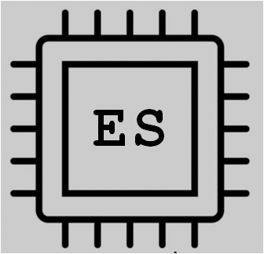
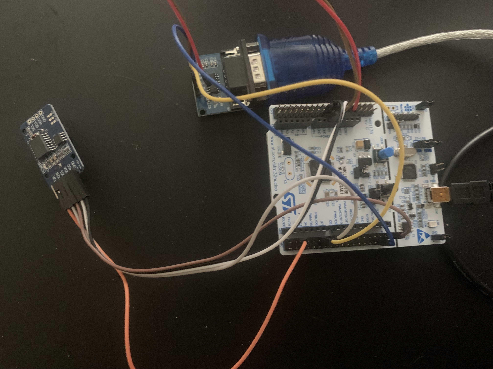
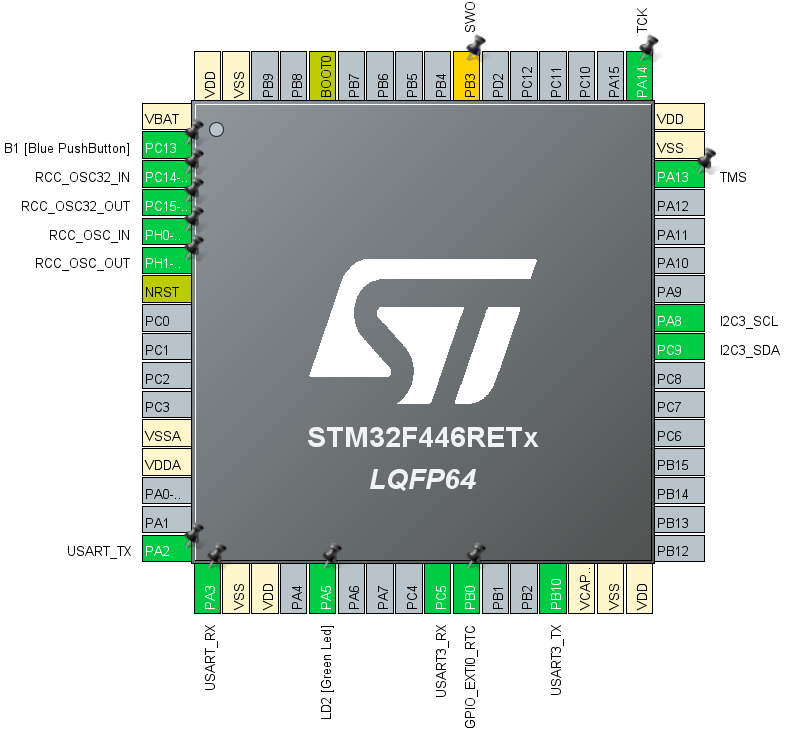

# Elray's Software

## STM32_NUCLEO_F446RE_DS3231_RTC
DS3231 Real-Time Clock Example running on a STM32 Nucleo F44RE Board 

## Hardware
STM32 Nucleo F446RE Board 
https://www.amazon.com/STM32-Nucleo-Development-STM32F446RE-NUCLEO-F446RE/dp/B01I8XLEM8/ref=sr_1_2?crid=101YPC710Y7SN&dib=eyJ2IjoiMSJ9.JPOkno9M-2bugItU_U0lY7VFzd-5qeoB426HZYK_NtFP36EN4U8Z_8MXPnQ_aKihHnleRSOOGaG0FO2WUt_5qfc_6jCc6MJADb8eAC66BbPw_xJwQTuTapWHWfRoWjGI6XbrhRylWQpxJd3Z3_DeGC9afSVlpOOgrWL9YwR9dl_Au_f4N69QpjpzDk0M-1ymA2Jqztc9l6-amP96j8Z5TQQNAC0_asdvTGV-ejzJ3cg.tOosgdFMqUL_QZwOpVSDHZH-79cEIz8ABZ_uCEzodFs&dib_tag=se&keywords=STM32NucleoF446RE&qid=1743967979&sprefix=stm32nucleof446re%2Caps%2C340&sr=8-2

USB-A to Mini USB 2.0 Cable 
https://www.amazon.com/Amazon-Basics-Charging-Transfer-Gold-Plated/dp/B00NH13S44/ref=asc_df_B00NH13S44?mcid=0e94dfb88b9836028ae009aa6f74fe35&hvocijid=12401336652434503946-B00NH13S44-&hvexpln=73&tag=hyprod-20&linkCode=df0&hvadid=721245378154&hvpos=&hvnetw=g&hvrand=12401336652434503946&hvpone=&hvptwo=&hvqmt=&hvdev=c&hvdvcmdl=&hvlocint=&hvlocphy=9027192&hvtargid=pla-2281435179498&th=1

DS3231 Real-time Clock Module 
https://www.amazon.com/s?k=ds3231+rtc+module&crid=EIEIQ8HMZA46&sprefix=DS3231%2Caps%2C226&ref=nb_sb_ss_ts-doa-p_3_6

Breadboard Jumper Wires 
https://www.amazon.com/EDGELEC-Breadboard-Optional-Assorted-Multicolored/dp/B07GD2BWPY/ref=sr_1_1_sspa?crid=2IVAP6IRRB2XB&dib=eyJ2IjoiMSJ9.9LdBtSOJTNABI74XKEk3MWXgyBTr1lFwCfxKWljdCE-_aCgp87sVh2sgo-OmBKlmECSN06_TuOxyNfcp4V7b-UiukcGlMwCJ1kTVneCSmEHbWXudP61P5lTk_roq-skHpmf6z7XFgc09C8Kft2UJllIdYH-78XXSgUXFg7NV344sUOs0dvhlCOZugXw8OGL0K2vdHKUTD4p9m4P3yYONhf3ztH4o7BHKTg4ogpwuSEY.2M6Ogq8b49RfpmzRZ5jIMNKXqtBA-EmgYhu_BhOAQjE&dib_tag=se&keywords=breadboard%2Bjumper%2Bwires&qid=1743968336&sprefix=breadboard%2Bju%2Caps%2C228&sr=8-1-spons&sp_csd=d2lkZ2V0TmFtZT1zcF9hdGY&th=1

Optional MAX3232 RS-232 to TTL Converter 
https://www.amazon.com/HiLetgo-MAX3232-Converter-Module-Serial/dp/B00LPK0Z9A/ref=sr_1_3?crid=2N1I1ZJAHPCDL&dib=eyJ2IjoiMSJ9.vrr8zsXVqv-kvFE2q4yEdWLNHuwrDXtKEHUageViC0S6Ed6241JMStahfWn_aSdONxAtXqnpHG73XxwOkHICYzsbXfblMJ7OTqzrwmt_dvK8YJXAkGnk2r6G1q_EKIRue9UbSVh3Id8bLNqUnc10CSjPetcEC4tmIn5JgYIkJzPn3quQOGJYlQcQNYyE7iAOPRLxt7KQDVfdGpGJJV_FH8TtDuFvJ5X0pDAOsBRiX_A.6OIjngeU313VX8dbsy5NiBxbEJTCUhaeVSHw-KgcHcQ&dib_tag=se&keywords=rs-232+to+ttl&qid=1743968155&sprefix=rs-232+to+ttl%2Caps%2C210&sr=8-3

Optional USB to RS-232 Converter 
https://www.amazon.com/Serial-Adapter-Chipset-Supports-Windows/dp/B017D51ZRQ/ref=sr_1_11?crid=7P1GTWM7P6VA&dib=eyJ2IjoiMSJ9.F1mNjRuCgIrcefkMMVMVk7xoBpk0sPm-F7UoOXpWWDOCGdyVchI0ToqNQB2UEpE3NRiG1A0GVuFivTUaFwhGFbOFvHk84DrhEK-tGscUJWPrJLNcqYi_ckV70UkBRvGnsr9EsULDBO7mSnR1MEwSnNaaUO0g7kXbSHOvIEGk9lzvZzCyFfnXPn_Q3JZXOA2b5DTYU8qc8IOYOuhEpTst_UZfm3pSWGs21g-lT8_vJVk.aP_lvI2-P3jprOGwHx1R-zz9zOmdpKh9kD0jdLWR5Us&dib_tag=se&keywords=usb%2Bto%2Brs-232%2Bserial%2Badapter&qid=1743968456&sprefix=usb%2Bto%2Brs-232%2Bserial%2Badapter%2Caps%2C199&sr=8-11&th=1

## Software Tools
STM32 CubeIDE Version 1.18.0 or newer 
https://www.st.com/en/development-tools/stm32cubeide.html

## Pinouts

**F446RE Pin** | **DS3231 Pin**
GND | GND 
3.3V | VCC 
PC9 | SCA 
PA8 | SCL 
PB0 | SOW

